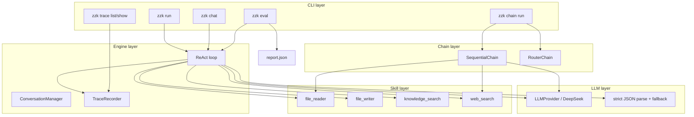

# Agent Harness (zzk)

[](https://github.com/ling87-bang/agent-harness-zzk/actions/workflows/ci.yml)

Lightweight **Agent Harness** runtime: strict JSON ReAct loop, pluggable skills, JSONL traces, and golden-case eval with machine-readable reports.

**Repository:** [github.com/ling87-bang/agent-harness-zzk](https://github.com/ling87-bang/agent-harness-zzk)

| Metric | Value |
|--------|--------|
| Automated tests | 150 (`pytest`) |
| Line coverage | ≥ 90% on `harness/` |
| Standardized `error_code` values | 10 (`parse_failed`, `llm_error`, `tool_*`, `chain_route_miss`, …) |
| Bundled eval cases | 6 live smoke + 5 CI mock (`eval/cases.json`, `eval/cases.ci.json`) |

## What it is

- **For end users:** type natural language — `zzk run "…"` or `zzk chat`. The model decides when to call tools; no extra flags required.
- **For builders:** a small, protocol-first runtime you can extend with Skills, compare prompt versions with eval, and debug via JSONL traces.

Pairs well with a separate RAG backend (e.g. KnowledgeOps Copilot): `knowledge_search` calls your HTTP API when available, or falls back to a local SQLite demo DB.

## Architecture



**Flow:** CLI → `run_single_turn` → stream LLM → parse `tool` / `answer` → optional skill → append trace → eval aggregates `task_success_rate` and writes `report.json` with per-case `run_id` for `zzk trace show`.

## Features

| Area | Capabilities |
|------|----------------|
| **ReAct** | Strict JSON `tool` / `answer`, streaming tokens, max-step guard, tool output truncation |
| **Chat** | Multi-turn history under `~/.zzk/conversations`, compression by message count and chars |
| **Skills** | `file_reader`, `file_writer`, `knowledge_search`, `web_search`; optional user skills from `~/.zzk/skills` |
| **Safety** | Workspace path allowlist + blocked dirs (shared `path_policy` for read/write) |
| **Chain** | Deterministic `sequential` / `router` pipelines (`llm`, `skill:*`, `transform:*`) |
| **Quality** | JSONL trace, `zzk trace show`, golden eval, CI report artifact, prompt v1/v2 compare |

## ReAct vs Chain

| | ReAct (`zzk run` / `zzk chat`) | Chain (`zzk chain run`) |
|--|--------------------------------|-------------------------|
| Decision model | LLM chooses tools each step | Developer-defined step list |
| LLM output | Strict JSON (`tool` / `answer`) | Plain text per `LLMNode` |
| Typical use | Open-ended tasks | Fixed pipelines you reuse |
| Trace | Full JSONL per run | Chain steps in same trace format |

## Install

```bash
git clone https://github.com/ling87-bang/agent-harness-zzk.git
cd agent-harness-zzk
python -m pip install .
```

Development:

```bash
python -m pip install ".[dev]"
pytest
```

## Configuration

Copy `.env.example` to `.env`:

```env
ZZK_DEEPSEEK_API_KEY=your_deepseek_api_key
ZZK_DEEPSEEK_BASE_URL=https://api.deepseek.com
ZZK_DEEPSEEK_MODEL=deepseek-chat
ZZK_DEEPSEEK_TIMEOUT_SECONDS=30.0

ZZK_KNOWLEDGE_PROVIDER=auto
ZZK_KNOWLEDGE_BASE_URL=http://127.0.0.1:8000/knowledge
ZZK_KNOWLEDGE_API_KEY=
ZZK_KNOWLEDGE_TIMEOUT_SECONDS=10.0

ZZK_SEARCH_PROVIDER=duckduckgo
ZZK_SEARCH_API_KEY=
ZZK_SEARCH_TIMEOUT_SECONDS=10.0

ZZK_PROMPT_VERSION=v2
ZZK_ENABLE_USER_SKILLS=false
```

| Variable | Notes |
|----------|--------|
| `ZZK_SEARCH_PROVIDER` | `duckduckgo` (no key) or `serpapi` (live web results for demos) |
| `ZZK_KNOWLEDGE_PROVIDER` | `auto` \| `http` \| `sqlite` \| `mock` |
| `ZZK_PROMPT_VERSION` | `v1` (minimal) or `v2` (JSON examples, default) |

## Usage

**Single-turn (most users only need this):**

```bash
zzk run "你好"
zzk run "读取 README.md，把 100 字摘要写到 notes/summary.md"
```

**Interactive chat:**

```bash
zzk chat
zzk chat --conversation-id conv-123456789abc
```

**Evaluation & prompt comparison (maintainers):**

```bash
zzk eval --cases-file eval/cases.json --report-out eval/report.json
zzk eval --cases-file eval/cases.json --compare-prompts v1,v2 --report-out eval/prompt-compare.json
zzk eval --cases-file eval/cases.json --workers 4
```

**Trace inspection:**

```bash
zzk trace list
zzk trace show run-abc123456789
```

**Chain (deterministic; needs API key when steps include `llm`):**

```bash
zzk chain list
zzk chain run sequential --steps "passthrough,transform:upper" "hello"
zzk chain run sequential --steps "llm,skill:web_search,llm" "today AI news"
```

**User-defined skills (optional):**

```bash
mkdir -p ~/.zzk/skills
cp examples/skills/weather_skill.py ~/.zzk/skills/
zzk run "上海天气怎么样" --enable-user-skills
```

Skills are **not** auto-invoked by keywords — the LLM picks `action: tool` after reading the tool list in the system prompt.

### Web search for demos

| Provider | Good for | Weak for |
|----------|----------|----------|
| `duckduckgo` | Zero-key dev and CI | Recent news, many Chinese queries |
| `serpapi` | Live demo with real URLs | Requires `ZZK_SEARCH_API_KEY` |

```env
ZZK_SEARCH_PROVIDER=serpapi
ZZK_SEARCH_API_KEY=your_serpapi_key
```

## Builtin skills

| Skill | Purpose |
|-------|---------|
| `file_reader` | Read UTF-8 text under workspace allowlist |
| `file_writer` | Write/append text; `overwrite: true` to replace existing files |
| `knowledge_search` | Query knowledge API or local SQLite fallback |
| `web_search` | DuckDuckGo Instant Answer or SerpAPI |

## Eval case format

```json
[
  {
    "id": "case-1",
    "query": "Say hello",
    "expected_contains": "hello"
  },
  {
    "id": "case-2",
    "query": "Read README.md",
    "expected_tools": ["file_reader"],
    "expected_contains": "Agent Harness"
  }
]
```

See `eval/README.md` for live vs CI cases.

## Local data

| Path | Content |
|------|---------|
| `~/.zzk/traces/*.jsonl` | Run/step trace (`record_type`, `step_type`, `error_code`) |
| `~/.zzk/conversations/*.json` | Chat history |
| `~/.zzk/skills/*.py` | Optional user skills (`skill` export required) |

## CI

GitHub Actions runs `pytest` (including mocked eval → `eval/report-ci.json`). Download the **eval-report** artifact to compare `task_success_rate` across commits.

## Project layout

```
├── harness/          # runtime package (cli, engine, llm, skills, chain)
├── tests/
├── eval/             # golden cases (not committed: report.json)
├── examples/skills/  # sample user skill
├── ARCHITECTURE.md   # design notes (Chinese)
└── pyproject.toml
```

## License

See repository default license (add `LICENSE` if you open-source publicly).
